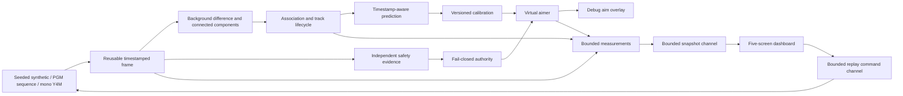

# Implementation status

## PCA9685 preparation update: 8 October 2026

[Servo milestone 2](pca9685-mock-adapter.md) adds a PCA9685 adapter with an in-memory I2C register model. It checks board configuration and pulse conversion, writes both servo channels in one transaction, verifies register readback, and tests inhibition, stale evidence, partial transactions, and latched faults. No physical transport is implemented. Replay composition is unchanged. Real board commissioning, live safety evidence, and independent physical inhibition remain open.

## Servo preparation update: 8 October 2026

The user selected a two-axis MG995 pan/tilt assembly and one PCA9685 module. [Servo milestone 1](pan-tilt-simulation.md) adds opt-in validated profiles, typed positions and pulse widths, deterministic movement and settling, safety cancellation, and dashboard positions. This is a simulation path. The physical adapter remains disabled. The power supply, real servo limits, physical calibration, and live safety validation remain open. The status below records the earlier replay work.

Date: 7 October 2026. Scope: software replay and virtual aiming. Hardware is not selected. Physical output is disabled. NanoNet image detection is assigned to a separate agent.

The later [stationary-target change and tests](repeated-image-test.md) add local spatial contrast to the detector. Performance figures below describe the earlier motion-only implementation; use new benchmark results for the current code.

## Implemented behavior

The workspace contains validated domain types, versioned configuration, structured logs, CI, and explicit fail-closed state transitions. Detection and tracking remain separate. Safety authority checks evidence again at command execution. Missing, stale, failed, uncertain, mismatched, or wrong-scope evidence suppresses output. Shutdown revokes authority. Replay evidence cannot permit live output.



The classical detector uses background difference, threshold, minimal neighborhood cleanup, connected components, and area/aspect filters. It reuses image and work buffers. The tracker uses deterministic one-to-one greedy association, measured-time velocity smoothing, and candidate, confirmed, temporarily lost, and removed states. Prediction uses constant velocity and measured timestamps.

The synthetic generator has 24 scenarios. These include all specified motion and distractor cases and all 11 safety-positive cases. Each seed reproduces the same pixels and metadata. Ground truth retains signed scene coordinates when a target is occluded or outside the frame. Visibility controls measurement scoring. Safety labels simulate framework behavior; they do not establish detector accuracy.

The dashboard displays actual replay frames, foreground masks, tracks, paths, predictions, virtual commands, latency distributions, accuracy, safety state, and calibration. It receives immutable snapshots at about 15 Hz. Publication never blocks processing. A snapshot older than 500 ms is marked stale. Recorded clearance is labelled as recorded evidence. Physical output remains disabled.

Replay pause, step, rewind, seek, and speed controls rebuild deterministic downstream state. A source fault clears aiming and latches shutdown until reset. Average FPS uses active playback time at the most recent processed frame. Pauses and idle refreshes do not reduce it. End-of-file freezes the displayed rate and active time. Playback pacing uses source timestamp differences. Reports are saved only for completed runs.

## Run and inspect

Run commands from the repository root in PowerShell. Report, calibration, and export destinations must be new paths.

```powershell
cargo run -p app -- --synthetic slow_fly
cargo run --release -p app -- --headless --synthetic fly_human --report target/human-run.json
cargo run --release -p app -- --headless --synthetic slow_fly --export target/sequence
cargo run -p app -- --sequence target/sequence/sequence.json --fixture-safety
cargo run -p app -- --video input.y4m
cargo run -p app -- --fit-calibration config/calibration-points.example.json --save-calibration target/calibration.json
cargo run -p app -- --synthetic slow_fly --calibration target/calibration.json
cargo run -p app -- --help
```

The calibration example is simulated. It must not be used as a measured physical calibration. Offline fitting solves a projective homography and validates separate held-out points. `--max-calibration-error` specifies the maximum normalized held-out error; the default is 0.01. The default replay calibration is an explicit virtual wall-plane mapping.

Use `--config config/example.json` to select processing and storage limits. Use `--seed`, `--frames`, and `--period-us` to specify a synthetic run. Disk sources use unavailable safety evidence by default. `--fixture-safety` permits label-based regression evidence only.

Keys `1` to `5` select screens. Space pauses replay. Left and Right step when paused or complete; Shift selects a larger step. Tab changes focus. Up and Down select a track. `+` and `-` change playback speed. `m` selects image or mask. Page Up and Page Down scroll. `?` opens help. `q` or Ctrl+C exits.

## Source and report formats

Image sequences use a version-1 JSON manifest with `size`, and `frames` containing `file`, `id`, `timestamp`, and optional `truth`. Timestamps are monotonic microseconds. IDs and timestamps must strictly increase. Paths must stay within the manifest directory. Images use binary PGM P5, an explicit width/height line, and a maximum-value line of 255. General PGM comments and arbitrary header layouts are not supported. Export produces this supported layout. Manifests are limited to 100,000 frames and 16 MiB.

Video replay supports progressive, monochrome Y4M with `Cmono` or `Cmono8`, explicit dimensions, and a rational frame rate. It streams pixels into a reusable frame. Compressed video and color conversion are not implemented. Corrupt or truncated input is an error.

Run reports use version 1. Exact nearest-rank distributions cover the most recent configured history samples; lifetime counts are separate. Source-time windows of 1, 5, 15, and 60 minutes and the full session use bounded histograms. Their quantiles are approximate upper-bin bounds. Counts, mean, RMS, and maximum remain exact. Latency units are microseconds. Prediction errors at 0, 5, 10, and 20 ms and virtual aiming errors use pixels and interpolated known truth. Missing truth is unavailable, not zero error. Frame-to-command latency has samples only when a virtual command is issued.

Compatible dashboard comparisons require identical dataset, configuration/calibration/algorithm fingerprint, hardware identity, build, and metric version. Set `FLY_TRACKER_HARDWARE_ID` to an accurate machine identifier for comparisons. Without it, identity is unverified and comparisons remain unavailable. Reports are bounded on load and published without overwriting an existing file.

## Measured checks

Formatting, strict workspace Clippy, and workspace tests pass on the Windows host. Tests cover source bounds and corruption, deterministic replay, seeded tracking properties, future prediction, calibration round trips, fault shutdown, storage, safety priority, stale snapshots, screen layouts, and controls. The full replay regression covers 24 scenarios with two seeds. No unsafe command was observed. The separate detector's process and real-inference integration tests require external resources and are ignored by default; these results do not validate that detector.

A Windows terminal check verified startup, help, screen navigation, normal quit, and cursor/alternate-screen restoration. Injected terminal I/O failures have not been validated. CI includes Windows/Linux checks and a Rust 1.90 build check; remote CI and local Rust 1.90 validation were not run in this session.

Release benchmark: 2,000 re-entry frames, seed 42, 320 by 240 pixels, 10 ms source intervals. Normal mode publishes every seven frames and draws to a 120 by 35 Ratatui TestBackend. This measures host software, not terminal transport, live camera latency, neural inference, or Raspberry Pi performance. Pipeline statistics below cover the final 1,024 samples. Maximum is also for that retained window.

| Mode | Total wall time | Pipeline P50 / P95 / P99 / max, microseconds | Dropped frames | Dropped snapshots |
|---|---:|---|---:|---:|
| Headless | 0.473 s | 228.5 / 298.2 / 393.8 / 524.4 | 0 | 0 |
| Normal dashboard | 0.609 s | 233.3 / 312.9 / 414.1 / 568.6 | 0 | 0 |
| Stalled dashboard | 0.523 s | 229.8 / 372.3 / 467.3 / 952.3 | 0 | 283 |
| Disconnected dashboard | 0.517 s | 223.8 / 297.0 / 424.5 / 539.2 | 0 | 285 |

Normal dashboard aggregation P50/P95/P99/max was 130.2/203.4/252.8/407.9 microseconds. Publication was 0.3/0.7/1.1/13.7 microseconds. TestBackend draw was 238.9/383.8/432.5/543.8 microseconds. Each has 285 samples. Offline replay processes every frame; zero dropped frames does not establish live overload performance.

The final 300-frame slow-fly run issued 297 virtual commands and zero unsafe commands. Frame-to-command P50/P95/P99/max was 228.6/342.3/461.6/684.6 microseconds. Prediction RMS at 0/5/10/20 ms was 0/0.266/0.531/0.658 pixels, with 297/296/296/295 samples. Virtual aiming RMS was 0.531 pixels. Detection matched the procedural sprite centers exactly; this does not establish real-image accuracy. Sequence export, disk replay with fixture safety, and saved calibration loading passed. The 300-frame fly-plus-human run issued zero commands and suppressed 297 target requests. Calibration fitting and held-out validation passed on the simulated example.

Repeat the benchmark with `cargo run --release -p app --example pipeline_benchmark`.

## Remaining product work

### Servo commissioning tools — 2026-10-08

The [offline servo commissioning tools](servo-commissioning.md) provide bounded single-axis jogs, settled observations under replay safety authorization, profile-bound versioned samples, homography fitting, and separate held-out validation in pixels. Reports cannot authorize physical output. Mapping rejects points outside the sampled region and mismatched assembly, camera, or profile bindings. Four regression tests cover movement, safety, fitting, bindings, and report storage. The example has four fit points and two validation points with maximum synthetic error below 2e-14 pixels. Host fit P50/P95/P99/maximum: 1.800/1.800/1.900/5.200 microseconds over 1000 fits. Live point acquisition, nonlinear grid fitting, and replay integration remain open. This step does not complete M10 or M11.

| Area | Required next work |
|---|---|
| Image safety detector | Separate agent owns NanoNet implementation. Integrate and validate real human, partial-human, dog, and cat images, confidence, failures, and inference budgets before live use. |
| OV9281 | Select camera board, connection, and driver. Implement a FrameSource adapter with acquisition timestamps, bounded freshness policy, and disconnect tests. |
| Physical galvo | Select DAC, analog interface, and inhibit wiring. Replace the disabled adapter only after implementing an independent physical inhibit and watchdog. Test faults and lockout on hardware. |
| Wall calibration | Acquire measured wall/galvo correspondences. Add controlled automatic acquisition, repeatability checks, and physical held-out error limits. Offline fitting alone does not complete M10. |
| Alignment | Use only the specified low-power alignment laser. Measure physical error and test safety lockout through the complete hardware chain. M11 remains open. |
| Real-world accuracy | Capture real wall/insect recordings. Tune and measure detection, identity continuity, occlusion recovery, and prediction. Greedy association can exchange IDs at crossings. Constant velocity limits accuracy under acceleration. |
| Resource validation | Measure CPU, memory, latency variance, live frame drops, and detector throughput on the Raspberry Pi 4 with 1 GB. Time-window storage can use about 30 MiB at full capacity. |

The detector warms up from its first frame. A target present in that background can be missed. Procedural fixtures do not replace a recorded real-image dataset. The replay app has no live hardware scheduler or independent physical watchdog thread. No physical device is opened. No physical enable flag exists.

M0 through M7 now have testable software implementations, with the stated real-data and operational validation limits. M8 through M11 remain hardware-dependent. Do not mark the complete product ready until those checks pass.
