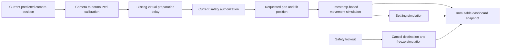

# Pan and tilt simulation

Date: 8 October 2026. Scope: servo milestone 1. Physical output is disabled.

The selected assembly has two MG995 servos and one PCA9685 module. This milestone prepares the configuration and movement model without opening an I2C device. It does not implement the PCA9685 driver or physical calibration.

## Run

Run these commands from the repository root in PowerShell:

```powershell
cargo run -p app -- --synthetic slow_fly --config config/pan-tilt-simulation.json
cargo run --release -p app -- --headless --synthetic slow_fly --config config/pan-tilt-simulation.json --report target/pan-tilt-run.json
```

The report destination must be a new path. The Live screen shows simulated angles, requested angles, destination pulse widths, channel numbers, movement state, and remaining settling time. Pulse widths are hypothetical values. They are not sent to the board. A stale view is labelled as a stale snapshot.

Existing configuration files keep the original virtual aimer. Set `pan_tilt_simulation` to a version-1 profile to select the simulator. Omit this field, or set it to `null`, to select the original virtual aimer. This field cannot enable physical output.

## Profile

The [example profile](../config/pan-tilt-simulation.json) assumes these simulation values:

| Parameter | Pan | Tilt |
| --- | --- | --- |
| PCA9685 channel | 0 | 1 |
| Minimum / centre / maximum angle | -45 / 0 / 45 degrees | -45 / 0 / 45 degrees |
| Minimum / centre / maximum pulse width | 1000 / 1500 / 2000 microseconds | 1000 / 1500 / 2000 microseconds |
| Maximum movement speed | 90 degrees/second | 90 degrees/second |

The assumed settling time is 100000 microseconds after both axes reach their destinations. These values are not measured MG995 specifications. Do not use this file as a physical calibration.

Each axis has independent channel, direction, centre, pulse limits, angle limits, and speed. The centre need not be halfway between the limits. Normalized negative and positive positions use separate linear spans around the centre. `reversed` changes pulse direction; it does not reverse the assembly coordinate shown on screen.

Validation rejects duplicate channels, channels outside 0 through 15, unsupported versions, unordered limits, non-finite angles or speeds, and excessive settling time. Schema bounds are angles within -360 through 360 degrees, pulse widths within 100 through 3000 microseconds, speeds within 0.001 through 1000 degrees/second, and settling time from 0 through 10000000 microseconds. These are software bounds. They do not establish safe physical travel. An angle request outside the configured travel is rejected, not clamped.

## Movement and cancellation



The simulator starts at the configured centre. Each axis moves at its configured maximum speed toward its destination. It never overshoots. Settling starts when the slower axis arrives. If a frame interval includes arrival and part of the settling period, both parts are processed in that update. Repeated identical commands do not restart settling. A new destination replaces the old destination. No movement queue is built.

Source timestamps control movement. Wall-clock time spent paused does not advance the simulation. Reset and seek rebuild the state from the assumed centre. Stop cancels the destination and keeps the last simulated position; it does not return to centre.

The safety authority checks the current frame and evidence scope before each command and simulation update. Missing, failed, stale, uncertain, mismatched, or revoked evidence cancels the destination. The denied frame interval does not advance movement. Clear recovery cannot resume the old destination. The pipeline must select a target and complete a new preparation wait. Target loss, rejected calibration, shutdown, source faults, and end of input also cancel the destination. The simulator rejects live evidence scope at construction.

The existing 500 ms virtual preparation delay is separate from travel and settling. An accepted command means that the simulator accepted a destination. It does not mean that the simulated assembly has arrived. `Settled` means that the configured simulation time has elapsed; it is not a measured alignment result.

## Validation and limits

Tests cover asymmetric centres, axis reversal, invalid profiles, numerical boundaries, unequal axis speeds, irregular timestamps, arrival and settling boundaries, retargeting, stale evidence, wrong evidence scope, lockout, recovery, reset, seek, source faults, target loss, shutdown, end of input, and dashboard labels. Each safety-positive synthetic scenario runs with seeds 42 and 73. Fixture labels test control behavior; they do not validate image safety recognition.

Run validation and host benchmarks:

```powershell
cargo fmt --check
cargo clippy --workspace --all-targets --all-features -- -D warnings
cargo test --workspace
cargo run --release -p app --example pan_tilt_benchmark
cargo run --release -p app --example pipeline_benchmark
cargo run --release -p app --example pipeline_benchmark -- --pan-tilt-simulation
```

The simulator has constant-size state and does not allocate during movement updates. The dashboard uses the existing bounded snapshot channel. CPU and process memory are not measured by these benchmarks.

## Measured host results

Formatting, strict workspace Clippy with all targets and features, and workspace tests pass on the Windows host. The existing three external NanoDet runtime/model tests remain ignored by default. Those tests and physical hardware behavior are not validated by this milestone.

The release pipeline benchmark used 2000 re-entry frames, seed 42, 320 by 240 pixels, and 10000 microsecond source intervals. Statistics cover the last 1024 pipeline samples. Normal rendering used a 120 by 35 Ratatui TestBackend with 285 publications. The baseline uses the original virtual aimer; the simulation run uses the example profile. Both runs retain the 500 ms preparation delay.

| Aimer | Mode | Pipeline P50 / P95 / P99 / maximum, microseconds | Wall time, seconds | Dropped snapshots |
| --- | --- | --- | --- | --- |
| Original virtual | Headless | 495.9 / 583.5 / 705.4 / 1055.4 | 1.038 | 0 |
| Original virtual | Normal | 496.5 / 611.1 / 828.5 / 2390.2 | 1.175 | 0 |
| Original virtual | Stalled | 511.0 / 642.6 / 955.9 / 1242.8 | 1.095 | 283 |
| Original virtual | Disconnected | 515.1 / 972.3 / 1079.2 / 1582.1 | 1.177 | 285 |
| Pan/tilt simulation | Headless | 493.8 / 615.8 / 698.1 / 1033.4 | 1.033 | 0 |
| Pan/tilt simulation | Normal | 494.7 / 593.3 / 717.3 / 1081.7 | 1.163 | 0 |
| Pan/tilt simulation | Stalled | 511.6 / 760.2 / 1018.2 / 1483.9 | 1.129 | 283 |
| Pan/tilt simulation | Disconnected | 517.4 / 754.0 / 979.4 / 1237.9 | 1.144 | 285 |

All eight runs reported zero dropped input frames. Offline replay processes every frame; this does not validate live overload behavior. These are single host runs with scheduling variance. Lower values in one mode do not establish a speed improvement.

For normal simulation mode, snapshot aggregation was P50/P95/P99/maximum 161.5/209.3/265.5/305.5 microseconds. Publication was 0.4/0.6/1.3/4.4 microseconds. TestBackend drawing was 267.8/361.6/445.5/518.6 microseconds. Each has 285 samples. These results do not measure terminal transport or Raspberry Pi behavior.

The standalone benchmark measured 20000 simulation updates and 100 destination commands. Update P50 was below the observed 0.1 microsecond timer resolution; P95/P99/maximum were 0.1/0.1/32.3 microseconds. Command P50/P95/P99/maximum were 0.1/0.1/0.4/1.3 microseconds. Do not interpret below-resolution samples as zero work. The benchmark reached the settled state on 9149 updates.

A separate 300-frame slow-fly run with the example profile completed, issued five simulated destination commands, and reported zero unsafe commands. Frame-processing P50/P95/P99/maximum were 493.9/562.3/681.5/745.7 microseconds. Physical output remained disabled.

## Remaining limits

The run report retains its existing virtual request-position error metric. It does not measure simulated servo arrival error or actual wall-point error. The normalized-to-angle mapping is an illustrative simulation mapping. The existing homography fitter has not been validated as a camera-to-servo mapping. There is no measured camera-to-servo calibration, visual correction, encoder feedback, acceleration model, mechanical-play model, supply validation, or physical watchdog validation.

The [PCA9685 adapter with mock I2C tests](pca9685-mock-adapter.md) is now available as servo milestone 2. Physical output must remain disabled until commissioning, live safety evidence, and independent output inhibition have been validated.
