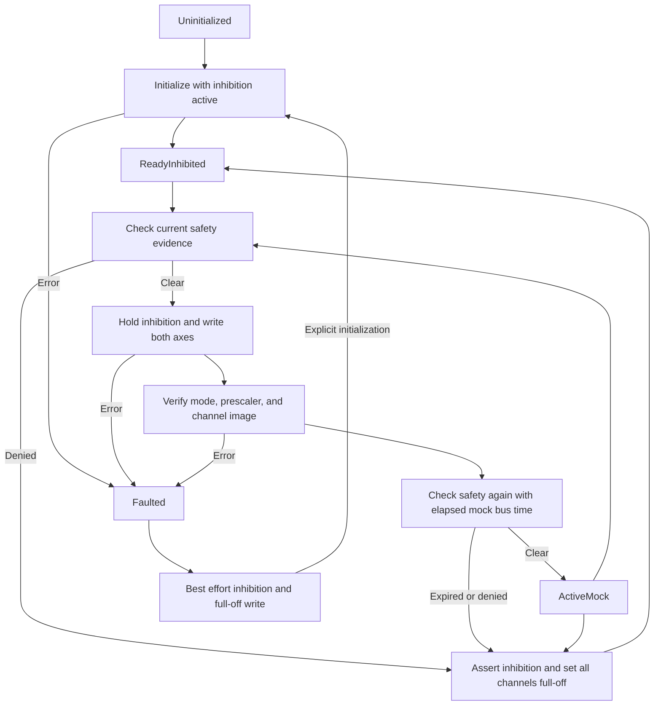

# PCA9685 adapter with mock I2C

Date: 8 October 2026. Scope: servo milestone 2. Physical output is disabled.

The hardware crate now contains a PCA9685 register adapter behind `AimingDevice`. Its only transport is an in-memory mock. No Linux I2C device, GPIO pin, servo, or alignment light is opened. The replay application continues to use the original virtual aimer or the [pan/tilt simulator](pan-tilt-simulation.md). This adapter is exercised separately through tests and a benchmark.

## Run

Run from the repository root in PowerShell:

```powershell
cargo test -p hardware
cargo run --release -p hardware --example pca9685_benchmark
```

The [board profile](../config/pca9685-mock.json) uses address 64 (hexadecimal 0x40), a 25000000 Hz oscillator estimate, and a requested 50 Hz PWM frequency. The benchmark combines this profile with the unmeasured simulation servo profile. These profiles do not establish safe physical settings.

The adapter accepts version 1. Addresses must be 0x40 through 0x77, excluding 0x70. This avoids the default All Call address and reserved I2C addresses. The servo adapter accepts requested frequencies from 40 through 60 Hz and oscillator estimates from 1000000 through 50000000 Hz. Duplicate channels and invalid servo limits are rejected before transport access. Live safety scope and unknown JSON fields are rejected.

## Register sequence

The register layout, prescaler formula, sleep requirement, oscillator startup interval, and STOP update mode follow the [NXP PCA9685 datasheet](https://www.nxp.com/docs/en/data-sheet/PCA9685.pdf).

Initialization performs these steps:

1. Assert the mock output inhibit.
2. Read MODE1. Reject an existing external-clock configuration.
3. If the oscillator is already awake, wait 500 microseconds in mock time. This covers recovery from an interrupted startup.
4. Set all channels to full-off.
5. Set MODE1 to sleep with register auto-increment enabled. Disable multicast addresses.
6. Set MODE2 to non-inverted totem-pole outputs, LOW when inhibited, with updates at STOP.
7. Write the calculated prescaler while asleep.
8. Wake the oscillator. Wait 500 microseconds in mock time.
9. Write a complete full-off channel image. Verify mode, prescaler, and channel registers.
10. Enter `ReadyInhibited`. Do not send a centre-position command.

For the example clock and frequency, the prescaler is 121. The actual PWM frequency is approximately 50.028817 Hz, and one counter tick is 4.88 microseconds. Pulse conversion uses that actual period. A 1500 microsecond request becomes 307 ticks, or 1498.16 microseconds in the model. The conversion rejects zero counts and counts above 4095.

Each accepted destination uses one 65-byte I2C write: one register address followed by 64 channel-register bytes. Both selected axes are included in that transaction, even when their channels are not adjacent. All other channels remain full-off. The adapter owns the complete board; do not plan to share its spare channels with another writer.

## Safety and fault behavior



No failed transaction is acknowledged as an issued command. A failed write can have changed some registers. The adapter first uses the separate mock inhibit path, then attempts a full-off I2C write. A fault stays latched until explicit initialization succeeds. Clearing safety evidence alone does not resume an old destination.

`watchdog` checks freshness even when no new destination is requested. A lockout stops output. `try_stop` returns typed errors. The `AimingDevice::stop` method and destructor perform the same stop attempts. Stop preserves a latched fault.

If asserting inhibition fails, `inhibit_confirmed` becomes unavailable. Do not interpret that state as proof that output is disabled. The mock models the inhibition path independently from the I2C connection.

## Mock and validation

The register model supports transaction failures, partial writes, corrupt readback, disconnects, failed inhibition, register changes, and elapsed time per I2C transaction. It checks prescaler writes while asleep and rejects PWM register access during its oscillator startup window. The trace retains at most 64 fixed-size events. Commands have no queue and allocate no new buffers after initialization.

Tests cover every initialization and command operation failure, every partial burst length from 0 through 64 bytes, nonadjacent channels, reversal, address validation, readback mismatch, stale camera and safety evidence, wrong evidence scope and frame, shutdown, explicit recovery, timer overflow, and bounded traces. Pulse conversion is checked across three clocks, three frequencies, and all integer pulse widths from 100 through 3000 microseconds. Each safety-positive synthetic scenario runs with seeds 42 and 73 and must issue zero mock commands.

The release benchmark measures batch-average CPU cost against the register model. It includes safety evidence updates, pulse mapping, register writes, readback, and mock inhibition. It uses 100 commands per batch, discards 100 warmup batches, and retains 2000 measured batches. It does not measure physical I2C latency, electrical pulse integrity, servo movement, Linux scheduling, terminal rendering, Raspberry Pi performance, CPU utilization, or process memory.

## Measured validation

Formatting, strict Clippy with all workspace targets and features, and workspace tests pass on the Windows host. All 14 adapter regression tests pass. Three existing external NanoDet process/model tests remain ignored by default and are not validated by this milestone.

The release benchmark completed 210000 mock commands, including 10000 warmup commands. It retained 2000 batch-average samples, with 100 commands per sample. P50/P95/P99/maximum were 0.184/0.194/0.288/1.214 microseconds per command. These are percentiles of batch averages, not individual command latency percentiles. The trace stayed at 64 events, and stop left the model inhibited. The clock estimate remained unmeasured; the calculated frequency was 50.028817 Hz with prescaler 121.

## Physical validation limits

The mock is a limited register model, not an independent hardware validation. Inhibition is instantaneous in the model. A real transport must validate timing, bus faults, signal levels, output-enable wiring, and independent watchdog behavior. Register readback cannot establish shaft position or pointing accuracy. Holding output enable during writes can affect pulse shape; validate that behavior before physical use.

No physical enable option exists. The adapter does not provide motion ramping, settling feedback, or wall calibration. The next milestone is commissioning and calibration tools that remain usable in simulation. Hardware commissioning must measure servo limits, supply stability, movement, and physical inhibition before live output is enabled.
