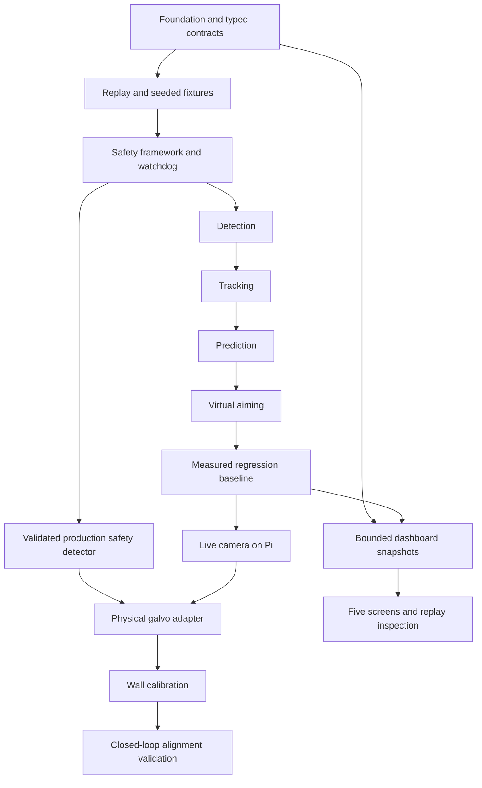

# Product audit and implementation plan

This document records the pre-implementation audit. For the implemented result and remaining work, read [implementation status](implementation-status.md).

Audit date: 7 October 2026. Scope: the current working tree, including uncommitted dashboard work. This audit does not change runtime code.

## Requirements and evidence

Use [AGENTS.md](../AGENTS.md) as the product and engineering contract. The [repository skill](../.agents/skills/fly-tracker-development/SKILL.md) adds delivery rules and links to the [dashboard requirements](../.agents/skills/fly-tracker-development/references/dashboard.md). The [README](../README.md) describes the current starter state. Keep the [dashboard plan](ratatui-implementation-plan.md) for detailed T0–T10 tasks; use this plan for product dependencies.

All crate source files, manifests, dashboard tests, the render benchmark, and the root entry point were inspected. A crate directory or dependency declaration does not count as an implemented feature.

## Current result

The repository has a Cargo workspace and a functional dashboard foundation. It cannot acquire frames, detect insects, track targets, predict trajectories, establish safety clearance, or issue aiming commands. No end-to-end product milestone is complete. M0 is partial. Dashboard T1 has useful code and tests, but some terminal failure checks remain open.

| Area | Implemented evidence | Missing product behavior |
| --- | --- | --- |
| Workspace and core, M0 | Nine workspace members; edition 2024; root Rust 1.90 declaration; lockfile | Seven starter libraries contain only `add` and its generated test. No domain types, configuration loader, state machine, or CI workflow. Eight package manifests do not inherit the workspace Rust minimum. |
| App | File tracing for the dashboard; headless startup; typed application errors | Source/configuration selection, pipeline composition, resource ownership, bounded stage communication, fault handling, shutdown, recording and run completion |
| Camera and replay, M1/M8 | Camera crate shell | Frame representation, acquisition timestamps, `FrameSource`, video decoding, image sequences, synthetic input, live OV9281 adapter, freshness and drop policy |
| Safety, M2 | Dashboard displays a constant lockout message | No safety crate, evidence model, detector interface/backend, human/dog/cat inference, partial-body validation, watchdog, authoritative state machine, or output interlock. Screen text is not a safety controller. |
| Vision, M3 | Vision crate shell | Background model, difference, threshold, morphology, components, geometry filters, typed detections and debug images |
| Tracking, M4 | Tracking crate shell | Association, persistent IDs, timestamp-aware filtering, candidate/confirmed/lost/removed states, bounded storage and lifecycle reasons |
| Prediction, M5 | No implementation | Velocity estimation, latency compensation, horizon policy, numerical validation and measured errors at 0/5/10/20 ms |
| Aiming, M6/M9/M10/M11 | Aiming and hardware crate shells | `AimingDevice`, virtual output, calibration mapping/schema, command-time safety enforcement, physical galvo adapter, automatic calibration and alignment validation |
| Telemetry, M7 | Telemetry crate shell; one shell-render benchmark | Stage and end-to-end timings, distributions, accuracy, counters, bounded histories, snapshots, persisted reports and comparable runs |
| Dashboard | Five shells; navigation/help/quit; size handling; approximately 15 Hz loop; cleanup guard; six semantic tests | Real data, viewport, trajectories, focus/selection, safety evidence/freshness, all performance windows, run comparisons, calibration workflow, replay controls and separate command/publication channels |
| Fixtures and tests | Seven arithmetic tests and six dashboard tests | All insect and safety fixtures, ground truth, explicit seeds, property tests, deterministic replay/regressions, numerical boundaries and hardware tests |
| Delivery | Ignore rules and reproducible application lockfile | CI, configuration examples, deployment procedure for Pi, resource budgets, hardware compatibility evidence, operational recovery and product acceptance report |

The root `src/main.rs` contains Hello World and is outside the listed workspace packages. Resolve its purpose during M0 so there is one documented application entry point. Shared dependency declarations such as serde, nalgebra and thiserror do not establish subsystem implementation.

## Validation performed

The following checks passed on the audit working tree:

- `cargo fmt --check`
- `cargo clippy --workspace --all-targets --all-features -- -D warnings`
- `cargo test --workspace`: 13 tests passed; seven test generated arithmetic and six test dashboard foundation behavior.
- `cargo run -p app -- --headless`: exited successfully and reported no connected pipeline.

`cargo run -p tui --example render_benchmark --release` measured 1,000 draws after 100 warmups, using a 120 × 35 TestBackend across five shells. P50: 128 microseconds; P95: 178; P99: 224; maximum: 393. These are host shell-render measurements. They do not establish camera latency, pipeline throughput, terminal output cost, safety performance, Pi resource use, or physical accuracy. Interactive terminal and injected I/O failure checks were not repeated in this audit.

Passing starter tests does not establish product readiness. No safety-positive sequence or end-to-end pipeline can currently be tested.

## Decisions required before dependent work

Record these decisions in versioned configuration or a design note at the specified gate. Do not invent acceptance values from the starter implementation.

| Gate | Decision |
| --- | --- |
| M0 | Units, timestamp rules, coordinate bounds, buffer capacities, frame and safety freshness limits, valid state transitions, lockout recovery policy and configuration validation |
| M1 | Replay format, decoder, frame timing, dataset schema, licenses for fixture assets and deterministic replay semantics |
| M2 | Safety backend and training/validation data; confidence/uncertainty policy; partial-human/animal coverage; watchdog deadline; sensor field of view; physical inhibition strategy before hardware enablement |
| M3–M5 | Required insect sizes/speeds, lighting/background range, detection and continuity thresholds, prediction error limits and maximum supported horizon |
| M7 | Target resolution/rate; P95/P99/maximum latency budgets; memory/CPU limits for the 1 GB Pi; dashboard overhead budget; comparable-run definitions |
| M8–M11 | Exact camera/driver, DAC and analog interface, galvo limits/settling behavior, hardware fail-off behavior, wall geometry, permitted alignment setup and physical accuracy limits |

Synthetic safety labels can test control logic. They cannot prove that a detector recognises people or animals in camera images. Keep output disabled when validated safety evidence is unavailable. A watchdog that runs only when a frame arrives cannot handle stopped input; it must also expire permission when no frame arrives.

## Implementation sequence

Implement one independently testable milestone at a time. At each gate, run formatting, strict workspace Clippy, workspace tests and relevant benchmarks. Record results and limits. Start timing instrumentation when producers are added; do not postpone measurement until M7.

| Stage and prerequisites | Smallest coherent delivery | Acceptance gate |
| --- | --- | --- |
| M0 — foundation; first task | Replace core arithmetic with validated frame/target IDs, positions, velocities, normalized aim, galvo position, timestamps and confidence. Define separate detection/track types and system states including SafetyLockout. Add validated versioned configuration, safe startup/shutdown, library errors, tracing conventions, CI and domain tests. Align package Rust minimum declarations. Resolve the unused root entry point. | Invalid configuration and nonfinite/out-of-range coordinates are rejected. Startup has no output permission. State transitions give lockout priority. CI runs the three required checks. Test timestamp boundaries and coordinate constructors. |
| M1 — replay; requires M0 | Define `FrameSource` and a bounded/reusable frame contract in camera. Add image-sequence and prerecorded-video sources with source timestamps. Add seeded synthetic generation and per-frame ground truth. Compose a headless replay runner in app. | Repeated seeded runs produce identical frames/metadata. Reject invalid dimensions/timing and corrupt input. Test EOF, source failure and frame gaps. Report seed on randomized failure. All source modes use the same frame contract. |
| M2 — safety framework; requires M0/M1 | Add safety crate, evidence/health states, detector interface, controlled test backend, freshness checks, independent watchdog and authoritative interlock. Define lockout causes and recovery. Integrate a safety screen through immutable data. | Every safety-positive fixture produces SafetyLockout. Test unavailable/error/timeout/stale camera/stale result/uncertain confidence and track-visible-during-lockout. A recording output test double receives zero commands. Permission expires without new frames and is checked at command execution. A test backend is labelled simulated. |
| M2 production safety gate; before physical enablement | Select and integrate a real safety detector, with independent input handling and representative camera validation for partial and full humans/dogs/cats. Measure its resource and latency cost. | Report missed hazards and uncertain cases, including edge hands/arms and mixed fly scenes. Faults and uncertainty lock out. Validate against stated coverage and timing limits. A passing framework alone does not satisfy this gate. |
| M3 — detection; requires M1/M2 | Implement reusable background/difference/mask/component buffers, minimal morphology and geometry filtering. Publish detections and debug masks. | Measure false positives/negatives and detection timing on empty, fly and distractor fixtures. Test difficult backgrounds, takeoff/landing and boundary objects. Do not use ground-truth labels as detector output. |
| M4 — tracking; requires M3 | Separate association, filtering and lifecycle. Use persistent IDs and `[x,y,vx,vy]` with measured time intervals. Bound track capacity. | Test multiple targets, crossings, occlusion, loss/removal and re-entry. Document ID/reacquisition policy. Test irregular/repeated/backward timestamps and deterministic tie-breaking. Report continuity and ID errors. |
| M5 — prediction; requires M4 | Add timestamp-aware prediction and an explicit latency horizon policy. Compare prediction with time-matched ground truth. | Report error at current position and +5/+10/+20 ms. Test acceleration, missing observations, invalid numbers and horizon limits. Document model limits; do not assume a fixed frame interval. |
| M6 — virtual aiming; requires M2/M5 | Define `AimingDevice`, virtual adapter, versioned calibration mapping, target selection and requested/issued/suppressed command records. Render measured/predicted/requested points. | Coordinate round-trip tests pass where applicable. Reject missing/invalid calibration and out-of-region aim. Every lockout suppresses virtual commands, including stale permission queued before a fault. Measure virtual error from ground truth. |
| M7 — telemetry/regression; requires M1–M6 | Complete full-rate stage timing and direct acquisition-to-command timing; bounded aggregation, P50/P95/P99/max, accuracy and session counters. Persist versioned RunMetrics off the processing path. Add all fixtures and replay regression reports. | Same seed/configuration yields the same semantic report; wall-clock performance can vary. Define sample windows and denominators. Handle empty samples, zero baselines, missing truth, invalid values, schema/storage errors and incompatible runs. Measure normal/stalled/disconnected dashboard effects and enforce agreed budgets. |
| M8 — OV9281; requires M7 | Add live source adapter with acquisition-time monotonic timestamps, latest-frame/drop policy, clear device ownership and capture-to-replay recording. Add Pi build/deployment steps. | Existing downstream APIs remain unchanged. Camera stop/disconnect locks out. Replay reproduces recorded failures. Measure stage latency, dropped frames, memory and CPU on the actual Pi 4, 1 GB. |
| M9 — galvo adapter; requires M8 and production safety gate | Implement the DAC/analog adapter behind AimingDevice. Specify bounded commands, range/rate limits, default inhibition, watchdog, shutdown and fault handling. | Hardware tests verify suppression during each lockout, camera loss, detector failure, process failure and shutdown. Queued commands cannot survive permission revocation. Measure command/settling latency. Software assertions alone do not close this gate. |
| M10 — wall calibration; requires M9 | Implement controlled automatic calibration, point detection, fit, point rejection, residuals, versioned persistence and safe retry/restart/save. | Report RMS/max error and repeatability on held-out wall points. Reject degenerate fits, invalid schema and geometry mismatches. Safety checks apply during calibration and command execution. |
| M11 — closed-loop alignment; requires M10 | Validate the complete pipeline with only the specified low-power Class 1/2 alignment laser. Document operating setup and recovery. | Measure physical aiming error and end-to-end latency against defined limits. Validate full and partial human/dog/cat lockouts on the installed hardware, including fault injection. Publish final acceptance results and remaining limits. |

## Dashboard integration

Preserve the current T1 shell. Complete its pending startup/input/draw-error, Ctrl+C and terminal restoration checks. T2 needs M0 domain types; add immutable availability-aware snapshots, bounded nonblocking publication, bounded histories and a separate command channel. A slow, full or disconnected consumer must not delay processing.

Follow the existing T2–T10 dashboard order. Integrate T3 with M3–M6 producers, T4 with M2 authority, T5 with M7 reports, T6 with M4/M5 tracks, T7 with M10 calibration, and T8 with M1 replay plus complete downstream state. Unsupported capabilities remain unavailable until their owners exist. T9 covers degraded terminals; T10 measures overhead with identical replays and later on Pi. UI mock data does not complete a subsystem milestone.

Seek must restore background, safety replay state, tracks, prediction and counters through replay-from-start or complete checkpoints. Pausing replay or UI rendering must not freeze live watchdog checks. Recorded safety evidence never grants physical output permission. Command owners recheck capability and safety at execution.

## Required fixture backlog

Create the following labelled sequences during M1; use them in the applicable M2–M7 regression gates. Each generated frame needs ground-truth target coordinates, visibility, frame identity and timestamp. Record fixture/configuration version and seed. Missing truth must be reported as unavailable.

- Insect/distractor: empty wall; slow fly; fast fly; abrupt acceleration; takeoff; landing; leaving frame; re-entry; multiple flies; temporary occlusion; difficult background; dust/debris; moving non-target object.
- Safety: full human; partial human; edge hand; edge arm; full dog; partial dog; full cat; partial cat; fly plus human; fly plus dog; fly plus cat.
- Faults: detector missing/error/timeout; stale or stopped camera; stale safety result; insufficient confidence; invalid state; source corruption; full/disconnected telemetry; storage failure; invalid calibration.

Every safety-positive fixture must produce lockout and zero issued aiming commands. Validate the safety backend separately on representative real imagery. Add property tests for coordinate transforms and numerical boundaries. Add hardware-in-the-loop tests only when the relevant device is available.

## Recommended next change and final completion

Implement M0 next. Keep it limited to typed contracts, configuration, fail-closed states, application foundation, CI and meaningful tests. Do not connect physical output. Complete its acceptance gate before selecting M1.

The final product requires all M0–M11 gates, dashboard T1–T10 gates, complete fixture coverage, a common live/replay downstream pipeline, independently validated safety, physical suppression evidence, measured Pi resource use, and repeatable calibration/alignment results. Record limits and recovery steps in operator documentation. Dates and effort estimates remain open until detector, hardware and quantitative acceptance decisions are made.
