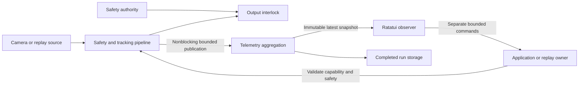

# Ratatui observability dashboard implementation plan

The baseline below records the original T1 stage. The connected implementation is described in [implementation status](implementation-status.md).

Add the dashboard in small, independently testable stages. Keep processing independent from terminal speed. Complete safety presentation before exposing supported output-related controls.

## Current baseline

### T1 implementation status

The dashboard foundation now has a dedicated tui crate, five screen shells, help, key event translation, responsive rendering, an approximately 15 Hz event loop, terminal cleanup, file logging and a headless startup check. All metrics remain unavailable. No processing or safety authority is connected.

Formatting, strict workspace Clippy and workspace tests pass on Rust 1.93.1. Six dashboard tests cover screen safety visibility, help, tiny and zero dimensions, layout thresholds, navigation, and Windows release/repeat events. A Windows PTY check confirmed startup, help and normal quit with cursor and alternate-screen restoration. Injected terminal I/O failure and Raspberry Pi checks remain pending.

A release TestBackend benchmark at 120 by 35 cells used 100 warmup draws and 1,000 measured draws across five shells. Host draw times were P50 126 microseconds, P95 170 microseconds, P99 239 microseconds, and maximum 368 microseconds. This does not measure terminal output, pipeline overhead, or Raspberry Pi CPU use. Run `cargo run -p tui --example render_benchmark --release` to repeat it.

The next stage is T2. It needs domain types and a bounded snapshot contract. T1 does not complete the full dashboard.

### Baseline before T1

The workspace has eight starter crates: core, camera, vision, tracking, aiming, hardware, telemetry, and app. Library crates contain an addition function and its test. The app prints Hello World. There is no safety crate, FrameSource, domain state machine, metrics implementation, or TUI. The root `src/main.rs` is outside the listed workspace packages.

The supplied task ends at the incomplete word `lock` in its Definition of done. The acceptance gates below use its complete requirements. No requirement is inferred from the missing ending.

## Proposed integration

Add `crates/safety` during M2 and `crates/tui` during T1. Keep shared domain types in core, safety authority in safety, dashboard models and aggregation in telemetry, and terminal behavior in tui. App owns composition and shutdown. Tui must not depend on hardware. Alias the local core package when importing it to avoid confusion with Rust's core library.



Use a bounded transport with a nonblocking producer. Specify full, disconnected and stale-data behavior before choosing the transport. A consumer drains pending snapshots and renders the newest. Publication must not wait for a TUI-held lock. Snapshot construction must also have a measured cost and bounded size.

Use acquisition timestamps for tracking, monotonic wall time for live freshness, and replay time for replay state. Store a UTC timestamp for persisted run identity. Do not use replay pause time to claim live safety freshness.

## Delivery stages

| Stage | Change and integration points | Acceptance gate and prerequisites |
| --- | --- | --- |
| T0 Inspect | Confirm crate ownership, current tests, runtime tools, and initial performance baseline. Select compatible Ratatui/Crossterm releases against Rust 1.90. | Record dependencies and test commands. This inspection is complete for the starter baseline; recheck before implementation. |
| T1 Foundation | Add tui with app/event/theme/layout modules, five screen shells, header/footer, help, lifecycle guard, and headless option in app. Send logs to a file or separate sink. | TestBackend covers responsive shells and tiny sizes. Manual terminal checks cover exit, startup failure, draw/input error, Ctrl+C and restoration. Missing data displays unavailable safety. No fabricated SAFE state. |
| T2 Telemetry | Add typed snapshots, availability, timestamps, bounded publication, separate control enums, capped histories and aggregation in telemetry. Use a clearly labelled mock source until producers exist. | A full or disconnected consumer cannot block publication. Test caps and missing/stale data. Requires M0 domain types; integrate M1/M2 producers when available. |
| T3 Live | Add viewport abstraction, preprocessed monochrome preview, target panel, measured stage latency, events and session counters. | Test no/one/multiple targets, legends and coordinate mapping. Unimplemented metrics show unavailable. Complete real integration after M3 to M6. |
| T4 Safety | Add safety screen and global lockout/fault presentation. Read authoritative state, evidence age, watchdog and interlock. Keep safety visible during UI pause. | Requires M2 for authoritative behavior. Test every safety-positive fixture, unavailable/error/timeout/stale/uncertain states, all screens and sizes. Confirm zero virtual aiming commands during lockout. |
| T5 Performance | Add versioned RunMetrics, bounded time-window series, percentiles, off-path storage, comparable run selection and direction-aware deltas. | Requires M7 measurements for real run reports. Test empty samples, zero baselines, percentage points, incompatible runs, invalid numbers, version errors and storage failures. |
| T6 Tracks | Add table, stable selection by TargetId, capped recent tracks, measured/estimated/predicted trajectories and loss reasons. | Requires M4/M5 real data. Test removed selected targets, lifecycle transitions, irregular timestamps, prediction horizons and selection focus. |
| T7 Calibration | Show calibration points, failures, residuals and version metadata. Add only supported retry/restart/save commands. | Read-only or unavailable view works before M10. Active operations require a supported owner and execution-time safety check. Test failures, absent calibration, coordinate mapping and rejected commands. |
| T8 Replay | Connect M1 source and the common pipeline. Add pause/step/speed, focused keys, frame metadata, deterministic rewind and ground-truth errors. | Freeze a failing frame with matching complete state. Compare seek output with replay from start. Test unsupported rewind and absent ground truth. |
| T9 Degraded modes | Validate large/medium/minimal layouts, limited color, basic symbols, SSH, resize, long values and telemetry disconnect. | Safety remains readable at usable small sizes. Zero dimensions do not panic. Help/footer describe available controls. |
| T10 Profiling | Compare headless, normal TUI, stalled TUI and disconnected TUI using identical seeded replays. Measure CPU, memory, publication, aggregation and draw costs. | Publish P50/P95/P99/max and dropped frames. Define acceptable overhead before declaring completion. Repeat on Raspberry Pi when available; mark host-only results. |

Follow T0 to T10 in order for dashboard stages. Implement only the prerequisite subsystem milestone needed for the next real integration. Mock shell work can proceed before the pipeline exists, but it does not complete M1 to M7. Do not add physical galvo output as a dashboard prerequisite.

## Implementation boundaries

Start tui with lib.rs, app.rs, event.rs, theme.rs, layout.rs, screens and widgets. Add modules when their stage needs them. Use pure render functions over immutable views. Keep selected screen, focus, selected target and help state in the UI model.

Distinguish requested aim from an actual issued command. Show suppression during lockout. A UI snapshot may report the last known interlock status, but it cannot grant permission. Missing or stale telemetry must not display a current SAFE or OUTPUT PERMITTED assertion.

Define snapshot limits, history limits, freshness limits and redraw rate in configuration. For a first implementation, propose 15 Hz redraw and capped rings; measure and set exact capacities in T2. Retain full-rate safety and tracking measurements outside the display sampling so charts do not hide rare failures.

Define metric denominators and units before comparisons. Evaluate prediction at current position and +5, +10 and +20 ms. Match delayed ground truth to the prediction timestamp. Mark unavailable measurements explicitly. Persist run schema version, fixture/configuration identity, optional commit, hardware/build context and metric definitions. Select best per metric within a comparable cohort.

## Validation for each implementation stage

Run formatting, Clippy and workspace tests after each coherent code change:

```powershell
cargo fmt --check
cargo clippy --workspace --all-targets --all-features -- -D warnings
cargo test --workspace
```

Add focused unit, property, replay and semantic rendering tests as applicable. Run relevant benchmarks and report conditions, fixture seed, sample count and limitations. Test real terminal restoration separately from TestBackend. Use host measurements until Raspberry Pi hardware is available.

## Completion gates

- All five screens display real supported data or an explicit unavailable state.
- Live and replay use the same downstream pipeline and screen models.
- Safety stays visible; every lockout suppresses virtual and permitted physical output at the domain interlock.
- No UI event or command can bypass safety.
- A stalled TUI cannot block processing, and histories remain bounded.
- Replay can reproduce and inspect a failed track with matching frame state.
- Run comparisons show underlying metrics and incompatible-run warnings.
- Terminal lifecycle, layouts, stale telemetry and safety regressions pass their checks.
- Required Rust validation passes, and measured overhead meets the agreed budget.
- Raspberry Pi and physical calibration limitations remain explicit until hardware validation is complete.
