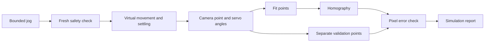

# Servo commissioning in simulation

This tool has no physical output. Safety clearance comes from a replay fixture. It does not establish that a real area is clear.

## Run the example

Use PowerShell in the repository root. Use new output paths. The tools refuse to overwrite a file.

```powershell
cargo run -p app --example servo_commissioning -- target/servo-samples.json
cargo run -p app --example servo_calibration -- target/servo-samples.json target/servo-report.json 0.01 simulation
```

The first command moves a virtual assembly in steps of at most five degrees. Each step changes one axis. The tool waits for motion and settling to finish. It then creates six observations from an explicit synthetic camera model with cross-axis coupling. Four observations fit the model. Two separate observations check the model.

The second command fits a homography and writes a versioned report. It reports RMS and maximum error in pixels. The maximum error must not exceed the supplied limit. These results measure the synthetic model only.



## API rules

- `CommissioningSession` owns one virtual assembly. It has no movement queue.
- A jog must be finite, nonzero, within five degrees, and within the configured travel. A jog during movement or settling is rejected.
- A sample requires settled movement, an in-frame camera point, and fresh safety clearance. Safety denial cancels movement.
- `ServoSamples` stores camera dimensions, assembly identity, the exact servo profile, frame IDs, timestamps, and separate fit and validation observations.
- Duplicate camera points, positions, or frame IDs are rejected. Use 4 to 256 fit observations and 1 to 256 validation observations.
- `ServoFitReport::map` checks profile, camera size, and assembly identity. It rejects points outside the convex hull of the fit observations.
- Loading a report recomputes the fit and validation results. Saved coefficients and saved error values are not trusted.

## Limits and next step

The homography is a first model. Real servo geometry, backlash, mounting offsets, and distance changes can produce nonlinear errors. Test separate physical observations before selecting a physical mapping model. Use a grid model if a homography fails the error limit.

The report is simulation-only. The replay application does not load this report automatically. The mapping API is an offline tool; its bounded triangle search is not intended for the frame-processing loop. Physical point detection, live commissioning, persistence of an incomplete session, and replay integration remain future work.

## Host measurement

Run `cargo run --release -p app --example servo_fit_benchmark -- target/servo-samples.json` after the example. The benchmark warms up with 100 fits, then measures 1000 fits. On the development host, the six-observation fixture gave P50/P95/P99/maximum values of 1.800/1.800/1.900/5.200 microseconds. These values exclude file I/O and do not measure Raspberry Pi or physical hardware performance.
